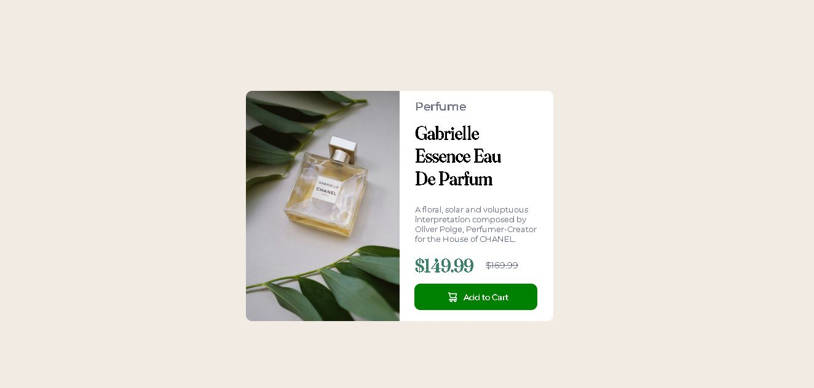
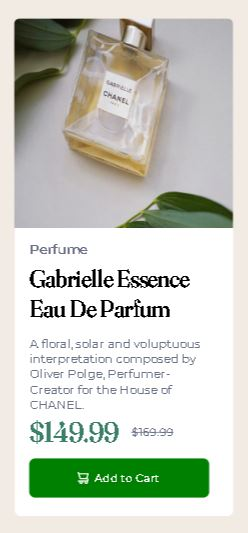

# Componente de cartão
Esse é o meu segundo projeto envolvendo HTML e CSS, é muito parecido com o primeiro, porém neste eu consegui ter mais facilidade em alguns aspectos.

Também nesse projeto me aventurei a escrever ele totalmente em inglês.

## Versão Desktop:

[]

[]

## Versão Celular:

[]

## Tecnologias utilizadas
- HTML
- CSS

